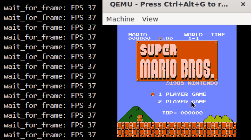
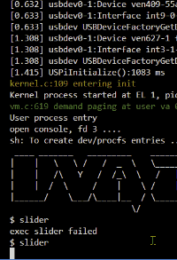
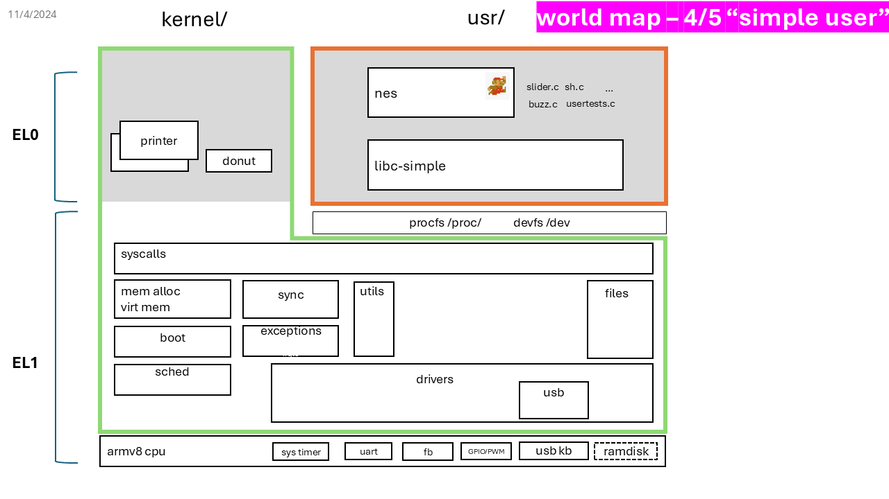

# UVA-OS WORLD 4 "Simple User" 
## To UVA students: the code will become available in Sp25

This is one part of the UVA-OS class (CS4414/CS6456). 

[OVERVIEW](https://github.com/fxlin/cs4414-main) |
[WORLD1](https://github.com/fxlin/uva-os-world1) |
[WORLD2](https://github.com/fxlin/uva-os-world2) |
[WORLD3](https://github.com/fxlin/uva-os-world3) |
[WORLD4](https://github.com/fxlin/uva-os-world4) |
[WORLD5](https://github.com/fxlin/uva-os-world5) 

### Students: see [quests-lab4.md](quests-lab4.md)

## GALLERY





https://github.com/user-attachments/assets/104c970d-fa47-4225-8ef6-645284de29f5

## DESIGNS

The OS now includes file abstraction and file systems. Userspace is built independently of the kernel and executed via exec(). The OS implements more I/O drivers, notably USB keyboard and sound device, exposing them via /proc and /dev to userspace. Userspace comprises a simplified libc and applications including Mario, slider, shell, and a sound tester.




This OS introduces virtual memory and user/kernel separation. It provides syscalls and can run one or multiple "Mario" applications concurrently in userspace.

✅ File abstractions

✅ A filesystem (xv6)

✅ procfs, devfs

✅ More syscalls: fork/write/exec/sbrk/write

✅ USB keyboard (can control Mario)

✅ Sound device

⛔ No FAT32 ⛔ No actual disks ⛔ No multicore

## USER SPACE

The "simple" userspace contains a minimalist "libc".

### DESIGNS

- Support filesystem (xv6).
- Programs will be built & linked as \*.elf binaries, and packed into a filesystem image (`mkfs.c`) which is then packed into `kernel8.img` as a ramdisk.

### LIBRARY

**`libc-simple/`**  
A minimalist "libc" that provides basic C functions and syscall stubs.

### PROGRAMS

**`LiteNES/`**  
The NES emulator that can load ROMs (e.g., Kung Fu, `md5sum: 27e5c62c6c`) from the filesystem (e.g., ramdisk). Executable: `nes`.

**`sysmon/`**  
System resource monitor.

**`buzz.c`**  
Plays raw waveform included in the C header; cannot load encoded files.

**`sh.c`**  
Shell.

**`slider.c`**  
Slide (static images) player.

**(other `*.c`)**  
Command-line utilities.

### HOST TOOL

**`mkfs.c`**  
An x86 program for packing all userspace into a filesystem image, which goes to the ramdisk image included in `kernel8.img`.

## Build

```sh
# for QEMU
export PLAT=rpi3qemu
# or, for rpi3
export PLAT=rpi3
```

To clean up:
```sh
./cleanall.sh
```

To build everything:
```sh
./makeall.sh
```

## Run

To run on QEMU:
```sh
./run-rpi3qemu.sh
```
