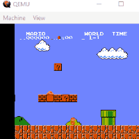
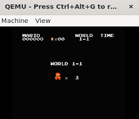

**NOTE on game speed**: okay you probably won't have much fun. 
* on a real rpi3, it's fast and enjoyable. 

* on WSL2 QEMU, it's slow. Like less than 1FPS. To start the game, make sure you press "I" long enough so the game can detect the key state change. 

* on Windows native QEMU, it's faster than WSL2 but still unplayable.

* on QEMU inside VM, untested but likely as slow as WSL2.

DELIVERABLE: take a photo showing that you can enter the stage screen. 

