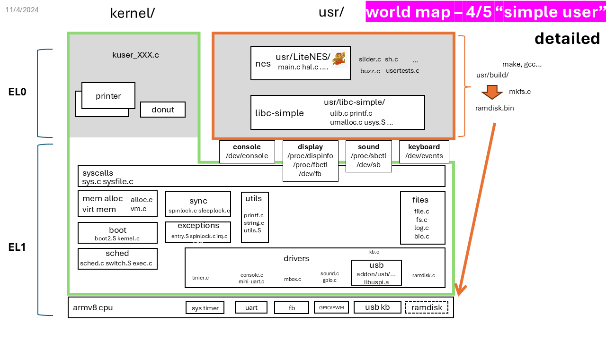
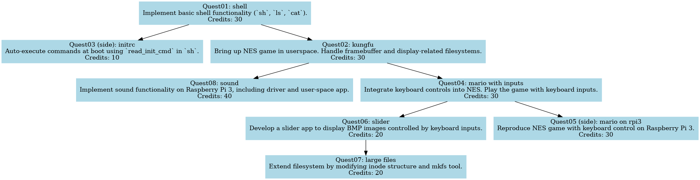
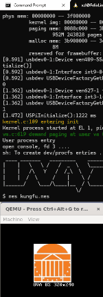
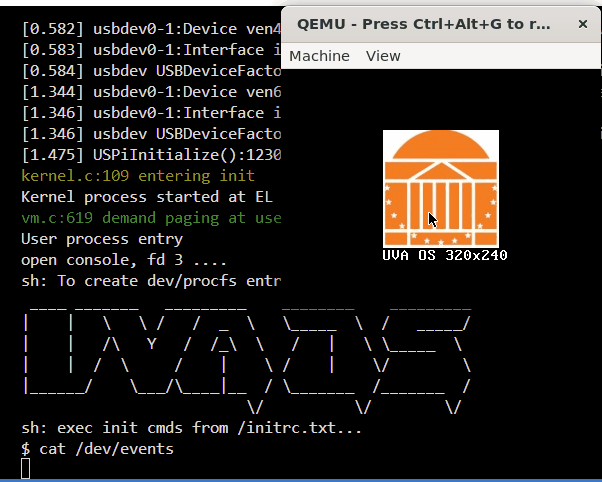
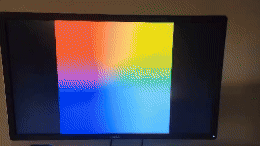

# Quests of Kernel Lab4 "Simple User"

Total estimated time: XXX hours

**NOTE** In all coding exercise below, see the comments in the code for hints and instructions.

**NOTE**. For picture/video deliverables, follow [requirements](./submission.md).

**NOTE**  in this lab, you deal with both the kernel (kernel/) and the user (usr/) codebases, and switch between back and forth. 
The description below differeniates between the two codebases as "usr" and "kernel".



| Quest      | Description                                                                                  | Credits |
|------------|----------------------------------------------------------------------------------------------|---------|
| [Quest01: shell](#quest01-shell)    | Implement basic shell functionality (`sh`, `ls`, `cat`).                                | 30      |
| [Quest02: kungfu](#quest02-kungfu)   | Bring up NES game in userspace. Handle framebuffer and display-related filesystems.     | 30      |
| [Quest03 (side): initrc](#quest03-side-initrc)   | Auto-execute commands at boot using `read_init_cmd` in `sh`.                            | 10      |
| [Quest04: mario with inputs](#quest04-mario-with-inputs) | Integrate keyboard controls into NES. Play the game with keyboard inputs.      | 30      |
| [Quest05 (side): mario on rpi3](#quest05-side-mario-on-rpi3) | Reproduce NES game with keyboard control on Raspberry Pi 3.                        | 30      |
| [Quest06: slider](#quest06-slider)   | Develop a slider app to display BMP images controlled by keyboard inputs.               | 20      |
| [Quest07: large files](#quest07-large-files) | Extend filesystem by modifying inode structure and mkfs tool. | 20      |
| [Quest08: sound](#quest08-sound)    | Implement sound functionality on Raspberry Pi 3, including driver and user-space app.   | 40      |

#### Total credits: 210 (main 170; side 40)
Credits exceeding 100 will be considered as bonus.




## Quest01: shell

The given kernel can already boot to launch the kernel process 
("Kernel process started...")

STEPS:

- [kernel] Understand kuser.c, complete user_process() so that it launches the user program "sh". 
- [usr] Grasp the idea of usr/sh.c; complete the code. 
    - create files for /dev and /proc
- [usr] Grasp the idea of usr/ls.c; complete the code.
 Make the output format as close to the reference output as possible.
- [usr] Complete usr/cat.c. 

CHECKPOINT: run `sh` in user mode and type `ls` to see the files, including ones under /dev and /proc. 
Check the reference output [here](./sh-output-example.md).
Run `cat logo.txt` which shows our OS logo. 

DELIVERABLE: take a video of the shell running `ls` and `cat logo.txt`.

## Quest02: kungfu

OVERVIEW: we will bring up nes again -- this time in the "simple" userspace that builds on file abstractions. 
With filesystem, nes can load a ROM (kungfu.nes) from a file in addition to the hardcoded ROM (mario) we dealt with before. 
With file abstractions, nes will need to read display configuration from /proc and render to /dev/fb. 
Therefore, we will bring up the display-related procfs and framebuffer device files.

> The two sub-quests below can be done in parallel.

> Use "./cleanall.sh && ./makeall.sh" to ensure all files are re-compiled.

SUB-QUEST 1. bring up display-related procfs: 

- [kernel] Understand how is procfs_parse_fbctl() invoked when user writes to /proc/fbctl, 
and how is procfs_gen_content() invoked when user reads from /proc/dispinfo. 
Complete `procfs_parse_fbctl()` and `procfs_gen_content()`. 

CHECKPOINT: in shell, try `cat /proc/dispinfo` to see the display configuration, 
and `echo 128 128 128 128 > /proc/fbctl` to change the display dimension.
Check the reference output [here](./sh-output-example.md).

To debug, add printf() to the aforementioned kernel functions to print the actual values read/written.

- [usr] From usr/libc-simple/uio.c, understand the idea of this file. 
        In this file, complete the functions that operate on procfs (display related):
    - `config_fbctl()` to change the display dimension by writing to /proc/fbctl.
    - `read_dispinfo()` to read display configuration from /proc/dispinfo.

You may write a simple user program to test these functions.

SUB-QUEST 2. bring up framebuffer device /dev/fb:

- [kernel] Understand how writes to /dev/fb are handled by the kernel and how `devfb_write()` gets invoked.

- [kernel] Complete `devfb_write()`. Finish `filelseek()` so nes can rewind to the start of the framebuffer periodically. 

- [usr] In usr/LiteNES/hal.c `nes_hal_init()`, operate on framebuffer device /dev/fb:
    - add a function call to open the device file
    - complete `nes_flip_display()`, so that it writes pixels to the device file.

CHECKPOINT: run `nes` from shell to see mario (as before).

FINALLY: 

- [usr] In usr/LiteNES/main.c, complete main() so it loads a ROM from a file, for which the filename is passed as an argument.

run `nes kungfu.nes` to see kungfu (1985).

DELIVERABLE. take a video showing that you can display the game (not necessarily playing it).



## Quest03 (side): initrc

- [usr] Complete `read_init_cmd` in usr/sh.c to read and execute a list of commands from a text file. 

This feature is useful for testing a list of commands repeatedly (e.g. launching multiple nes instances at the same time). 

DELIVERABLE: take a video that when the system boots, it automatically launches the nes (mario or kungfu) game, without user typing any command.

## Quest04: mario with inputs

OVERVIEW: we will bring up the keyboard driver and its device file, so that nes can receive inputs and we can control the game.

STEPS

> The two sub-quests below can be done in parallel.

SUB-QUEST 1: bring up the keyboard driver.

- [kernel] Grasp the idea of `kb.c`. Complete the event queue management with synchronization: `kb_intr` for enqueueing and `kb_read` for dequeuing. Finally `usbkb_init()` for registering the kb read function with the device file.

CHECKPOINT: from shell, launch `cat /dev/events`; click to focus on the qemu window, and type keys. You should see the stream of key events. 
"kd 0xXX" and "ku 0xXX" mean a key down and a key up event, respectively.

DELIVERABLE: take a short video showing that you can type and see the key events.



SUB-QUEST 2: [usr] add keyboard inputs to nes. 

- In usr/libc-simple/uio.c, finish `read_kb_event()` to read and parse key events from /dev/events.

In usr/LiteNES/hal.c: 

- understand how pipe() can be used to communicate between tasks.
cf. usertests.c pipe1() and pipe3(). nes has a similar architecture. 

- complete `nes_hal_init()` so that the keyboard task opens the keyboard device file and repeatedly reads key events and sends them via a pipe to the main task.

- complete `wait_for_frame()` so that the main task reads key events from the pipe and updates the keyboard (i.e. controller) state, every frame.

- complete `nes_key_state()` so that the main task can query the controller state.

Reference console output [here](./sh-output-example.md).

CHECKPOINT: run `nes` from shell to see mario. Use keyboard to control mario. Have fun!

DELIVERABLE: take a short video showing that you can use keyboard to control the game
(must capture both the screen and the keyboard).

* 10/23/24: an occasional bug (both qemu and rpi3). has low impact on assignment though. TBD
```
irq.c:180 Unhandled EL0 sync exception, cpu0, esr: 0x0000000002000000, elr: 0xffff0000007e2878, far: 0x0000000007ffffa0
irq.c:182 online esr decoder: https://esr.arm64.dev/#0x0000000002000000
```

## Quest05 (side): mario on rpi3

Reproduce the above quest on rpi3. Plug in a USB keyboard to the rpi3 and play the game.

**NOTE**: 
* WSL QEMU: the FPS is around 34 (per the emulated timer; the actual FPS may be lower). Playable. 


* Actual rpi3: the FPS is 38. But the input latency is much shorter. Quite enjoyable.



* 10/23/24: an occasional bug (both qemu and rpi3). has low impact on assignment though. TBD
```
irq.c:180 Unhandled EL0 sync exception, cpu0, esr: 0x0000000002000000, elr: 0xffff0000007e2878, far: 0x0000000007ffffa0
irq.c:182 online esr decoder: https://esr.arm64.dev/#0x0000000002000000
```

DELIVERABLE: take a video showing that you can play the game. 


## Quest06: slider

OVERVIEW: bring up the slider app which will display a series of slides (as bmp files) loaded from the filesystem; 
switch among slides is controlled by keyboard inputs.

- [usr] In usr/slider.c, complete the slider app: 
    - the loader function which read pixels from a BMP file to memory
    - the function that clears the screen 
    - the render() function which writes pixels to /dev/fb
    - the event loop in main() that reads kb events and changes the current slide number. 

- [usr] Copy your bmp files to usr/build/ and name them as Slide1.BMP, Slide2.bmp, etc. These file names are hardcoded in slider.c and can be verified and changed. 
    - We also provide sample bmp files (usr/slides/, each 320x240, 226KB) for you to test.

    - NOTE: because of the filesystem limitation, you can only have lowres bmps. Each bmp file cannot be larger than 270 KBs; and the total size of all bmp files should not exceed a few MBs.

CHECKPOINT: run `slider` from shell to see the slides. Use keyboard to switch among slides.


## Quest07: large files 

OVERVIEW: to extend the xv6 filesystem. Right now limits our apps are in two ways: 

1. a single file size is capped at 270KB, because as an inode lacks doubly indirect pointers. 
2. the total blocks per filesystem are too few, as its on-disk bitmap cannot span more than 1 block (512 bytes).

STEPS:

- [kernel] Extend the inode structure to support doubly indirect pointers. Complete `bmap()` in fs.c. 

- [tool] Extend usr/mkfs.c, which creates a filesystem image. 

> It's a host tool, meaning it runs on your build machine, e.g. WSL2, NOT as inside the qemu or as part of your OS. 
Debugging mkfs.c is much easier than debugging the OS kernel. 
e.g. just do ``gdb mkfs fs.img (files)`` from the WSL2 command line. 

    - Grasp the design of mkfs.c. 
    - Extend `balloc()` to support allocating more blocks per filesystem 
        (by operating on additional bits in the bitmap).
    - Extend `iappend()` to support more blocks per file via doubly indirect pointers. 

CHECKPOINT:
- load highres & tens of bmp files to usr/build/ and name them as slides. 
    - We also provide large bmp files (usr/slides/large/, each 960x720 and 2MB) for you to test.
    ```
    cp usr/slides/large/Slide3.BMP usr/build/
    ./cleanall.sh && ./makeall.sh
    (in OS shell) 
    slider
    (the forward to slide 3 which is the large bmp)
    ```
    Reference output [here](./sh-output-example.md).

- run `slider` to play the slides.

DELIVERABLE: take a video showing that you can play multiple highres slides.

## Quest08: sound 

THIS IS ONLY FOR RPI3; NOT FOR QEMU, which lacks sound hardware emulation. 

- To do this quest, you will need to plug a speaker in to the RPI3's 3.5mm audio jack. 

- Speakers can be obtained from the lab TA.

- Earphone should also work; but not recommended as any loud sound may damage your ear.

OVERVIEW: bring up the sound driver and its device file (/dev/sb), so that we can play simple sound from user space.

- The sound write path: sound.c
    - Understand /dev/sb: complete `devsb_write()`
    - Complete `sound_write()` and `GetNextChunk()`

- The irq path:
    - Complete `handle_irq()` (irq.c) to add DMA irq handling, and maintain DMA hardware 
    status by completing `DoDMAIRQ()`. 

CHECKPOINT: from kernel_main(), call `test_sound()` to play sound from the kernel space. 

- Understand /proc/sbctl: sound.c
    - read `procfs_sbctl_gen()`
    - complete `procfs_parse_sbctl()` for key commands

- The user space sound app: usr/buzz.c
    - complete its main logic for opening device files, load sound samples to 
    /dev/sb, and send command to /proc/sbctl for playback. 

CHECKPOINT: run `buzz` from shell to play sound.

DELIVERABLE: take a video showing that you can play sound.

Reference: 

https://github.com/user-attachments/assets/104c970d-fa47-4225-8ef6-645284de29f5
