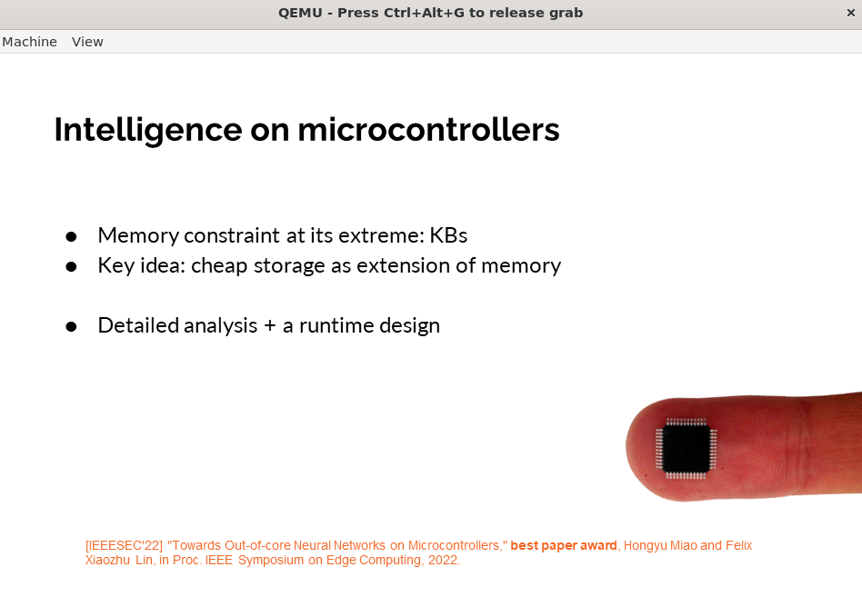

# Output Examples

## "ls ."

Your files may differ; but format shall be the same.

```bash
$ ls
.              1 1 560
..             1 1 560
Slide1.BMP     2 2 230454
Slide2.BMP     2 3 230454
buzz           2 4 218712
cat            2 5 95752
cpptest        2 6 120552
doom           2 7 3554064
echo           2 8 95032
font.psf       2 9 2080
forktest       2 10 95328
grep           2 11 100632
initrc.txt     2 12 50
initrc.txt.1do 2 13 180
initrc.txt.8ne 2 14 262
initrc.txt.blo 2 15 171
initrc.txt.mar 2 16 48
initrc.txt.old 2 17 180
kill           2 18 95032
kungfu.nes     2 19 40976
ln             2 20 94984
logo.txt       2 21 305
ls             2 22 100552
mkdir          2 23 95032
nes            2 24 85544
nes-good       2 25 192272
rm             2 26 95016
sh             2 27 114096
slider         2 28 135448
usertests      2 29 180688
wc             2 30 95928
console        3 31 0
tmp            1 32 32
proc           1 33 128
dev            1 40 160
```

## "ls /proc"

Both your contents and format shall be the same.

```sh
$ ls proc
.              1 33 128
..             1 1 560
dispinfo       4 34 0
cpuinfo        4 35 0
meminfo        4 36 0
fbctl          4 37 0
fbctl0         4 38 0
sbctl          4 39 0
```

## "ls /dev"

Both your contents and format shall be the same.

```sh
$ ls dev 
.              1 40 160
..             1 1 560
console        3 41 0
events         3 42 0
events0        3 43 0
fb             3 44 0
fb0            3 45 0
null           3 46 0
zero           3 47 0
sb             3 48 0
```

## /proc/dispinfo

```sh
$ cat /proc/dispinfo
   320    240    320    240      0      0   1280     32      0
#  width height vwidth vheigh swidth sheigh  pitch  depth  isrgb
```

## /proc/fbctl

To read, will get some help information:
```sh
$ cat /proc/fbctl
# format:  width height vwidth vheigh [offsetx] [offsety]
# ex1: echo 256 256 128 128 > /proc/fbctl // will reinit fb 
# ex2: echo 0 0 0 0 32 32 > /proc/fbctl // won't init. only change offsets
```

To write: 
```
$ echo "128 128 128 128" > /proc/fbctl
```
The display resolution will change to 128x128.

## boot message with /dev/events

```sh
xzl@FelixLin-XPS15 (main)[p1-kernel-lab4]$ ./run-rpi3qemu.sh 
------ kernel boot ------  core 0
build time (kernel.c) Nov 11 2024 15:30:09
phys mem: 00000000 -- 3f000000
         kernel img: 00080000 -- 0088c000
         paging mem: 0088c000 -- 3b900000
                 952M 243828 pages
         malloc mem: 3b900000 -- 3c100000
                 8M
         reserved for framebuffer: 3c100000 -- 3f000000
[0.564] usbdev0-1:Device ven409-55aa, dev9-0-0 found [from USBDeviceInitialize()]
[0.565] usbdev0-1:Interface int9-0-0 found
[0.565] usbdev USBDeviceFactoryGetDevice:Using device/interface int9-0-0
[1.343] usbdev0-1:Device ven627-1 found [from USBDeviceInitialize()]
[1.343] usbdev0-1:Interface int3-1-1 found
[1.344] usbdev USBDeviceFactoryGetDevice:Using device/interface int3-1-1
[1.448] USPiInitialize():1206 ms
kernel.c:109 entering init
Kernel process started at EL 1, pid 1
vm.c:619 demand paging at user va 0x7ffffa0, elr 0x12c
User process entry
open console, fd 3 ....
sh: To create dev/procfs entries ....OK
 ____ _______   _________    ________    _________
|    |   \   \ /   /  _  \   \_____  \  /   _____/
|    |   /\   Y   /  /_\  \   /   |   \ \_____  \ 
|    |  /  \     /    |    \ /    |    \/        \
|______/    \___/\____|__  / \_______  /_______  /
                         \/          \/        \/
sh: exec init cmds from /initrc.txt...
$ cat /dev/events
kd 0x1b
ku 0x1b
kd 0x04
ku 0x04
kd 0x1a
ku 0x1a
kd 0x07
ku 0x07
kd 0x1b
ku 0x1b
kd 0x16
ku 0x16
```

# Mario with inputs
        
```sh
$ nes
Usage: mynes romfile.nes
no rom file specified. use built-in rom
load rom...ok
   |          ________        |
   |    .    (Nintendo)       |
   |  _|w|_   ''''''''   .-.  |
   |-[a   d]-       .-. ( k ) |
   |   |s|         ( j ) '-'  |
   |    '           '-'       |
   |          ___   ___       |
   |           (u) (i)        |
   |        SELECT START      |
timer task running
input task running
FB_FLIP=0 SCREEN_WIDTH=256 SCREEN_HEIGHT=240
 /proc/dispinfo: width 256 height 240 vwidth 256 vheight 480pitch 1024 depth 32 isrgb 0
fb alloc ...ok
running fce 
wait_for_frame: FPS 38
wait_for_frame: FPS 37
wait_for_frame: FPS 37
wait_for_frame: FPS 37
```

# Slider with large files




# buzz command output
```sh

$ buzz
sound.c:1259 sound init chunksize=0
sound.c:1049 id = 0
sound.c:274 malloc_dma30 returns ffff00003b903890
sound.c:274 malloc_dma30 returns ffff00003b9036b0
sound.c:274 malloc_dma30 returns ffff00003b9078a0
sound.c:274 malloc_dma30 returns ffff00003b9037a0
sound.c:1129 audio init ok
written 4410 bytes
sound.c:1269 sound_start drv 0
sound.c:561 GetNextChunk: nChunkSize 2048
sound.c:572 GetNextChunk: nChunkSize 2048 nTransferLength 8192
sound.c:893 kick dma ch 12
sound.c:561 GetNextChunk: nChunkSize 2048
sound.c:572 GetNextChunk: nChunkSize 2048 nTransferLength 8192
written 2048 bytes
sound.c:637 DoDMAIRQ
sound.c:561 GetNextChunk: nChunkSize 2048
sound.c:572 GetNextChunk: nChunkSize 2048 nTransferLength 8192
sound.c:637 DoDMAIRQ
sound.c:561 GetNextChunk: nChunkSize 2048
sound.c:572 GetNextChunk: nChunkSize 2048 nTransferLength 8192
sound.c:637 DoDMAIRQ
sound.c:561 GetNextChunk: nChunkSize 2048
sound.c:572 GetNextChunk: nChunkSize 2048 nTransferLength 8192
written 3072 bytes
sound.c:637 DoDMAIRQ
sound.c:561 GetNextChunk: nChunkSize 2048
sound.c:572 GetNextChunk: nChunkSize 2048 nTransferLength 8192
sound.c:637 DoDMAIRQ
sound.c:561 GetNextChunk: nChunkSize 2048
sound.c:572 GetNextChunk: nChunkSize 2048 nTransferLength 8192
sound.c:637 DoDMAIRQ
sound.c:561 GetNextChunk: nChunkSize 2048
sound.c:572 GetNextChunk: nChunkSize 2048 nTransferLength 8192
written 3072 bytes
sound.c:637 DoDMAIRQ
sound.c:561 GetNextChunk: nChunkSize 2048
sound.c:572 GetNextChunk: nChunkSize 2048 nTransferLength 8192
sound.c:637 DoDMAIRQ
sound.c:561 GetNextChunk: nChunkSize 2048
sound.c:572 GetNextChunk: nChunkSize 2048 nTransferLength 8192
sound.c:637 DoDMAIRQ
sound.c:561 GetNextChunk: nChunkSize 2048
sound.c:572 GetNextChunk: nChunkSize 2048 nTransferLength 8192
written 3072 bytes
sound.c:637 DoDMAIRQ
sound.c:561 GetNextChunk: nChunkSize 2048
sound.c:572 GetNextChunk: nChunkSize 2048 nTransferLength 8192
sound.c:637 DoDMAIRQ
sound.c:561 GetNextChunk: nChunkSize 2048
sound.c:572 GetNextChunk: nChunkSize 2048 nTransferLength 8192
sound.c:637 DoDMAIRQ
sound.c:561 GetNextChunk: nChunkSize 2048
sound.c:572 GetNextChunk: nChunkSize 2048 nTransferLength 8192
written 3072 bytes
sound.c:637 DoDMAIRQ
sound.c:561 GetNextChunk: nChunkSize 2048
sound.c:572 GetNextChunk: nChunkSize 2048 nTransferLength 8192
sound.c:637 DoDMAIRQ
sound.c:561 GetNextChunk: nChunkSize 2048
sound.c:572 GetNextChunk: nChunkSize 2048 nTransferLength 8192
sound.c:637 DoDMAIRQ
sound.c:561 GetNextChunk: nChunkSize 2048
sound.c:572 GetNextChunk: nChunkSize 2048 nTransferLength 8192
written 3072 bytes
sound.c:637 DoDMAIRQ
sound.c:561 GetNextChunk: nChunkSize 2048
sound.c:572 GetNextChunk: nChunkSize 2048 nTransferLength 8192
sound.c:637 DoDMAIRQ
sound.c:561 GetNextChunk: nChunkSize 2048
sound.c:572 GetNextChunk: nChunkSize 2048 nTransferLength 8192
sound.c:637 DoDMAIRQ
sound.c:561 GetNextChunk: nChunkSize 2048
sound.c:572 GetNextChunk: nChunkSize 2048 nTransferLength 8192
written 3072 bytes
sound.c:637 DoDMAIRQ
sound.c:561 GetNextChunk: nChunkSize 2048
sound.c:572 GetNextChunk: nChunkSize 2048 nTransferLength 8192
sound.c:637 DoDMAIRQ
sound.c:561 GetNextChunk: nChunkSize 2048
sound.c:572 GetNextChunk: nChunkSize 2048 nTransferLength 8192
sound.c:637 DoDMAIRQ
sound.c:561 GetNextChunk: nChunkSize 2048
sound.c:572 GetNextChunk: nChunkSize 2048 nTransferLength 8192
written 3072 bytes
sound.c:637 DoDMAIRQ
sound.c:561 GetNextChunk: nChunkSize 2048
sound.c:572 GetNextChunk: nChunkSize 2048 nTransferLength 8192
sound.c:637 DoDMAIRQ
sound.c:561 GetNextChunk: nChunkSize 2048
sound.c:572 GetNextChunk: nChunkSize 2048 nTransferLength 8192
sound.c:637 DoDMAIRQ
sound.c:561 GetNextChunk: nChunkSize 2048
sound.c:572 GetNextChunk: nChunkSize 2048 nTransferLength 8192
written 3072 bytes
sound.c:637 DoDMAIRQ
sound.c:561 GetNextChunk: nChunkSize 2048
sound.c:572 GetNextChunk: nChunkSize 2048 nTransferLength 8192
sound.c:637 DoDMAIRQ
sound.c:561 GetNextChunk: nChunkSize 2048
sound.c:572 GetNextChunk: nChunkSize 2048 nTransferLength 8192
sound.c:637 DoDMAIRQ
sound.c:561 GetNextChunk: nChunkSize 2048
sound.c:572 GetNextChunk: nChunkSize 2048 nTransferLength 8192
written 3072 bytes
sound.c:637 DoDMAIRQ
sound.c:561 GetNextChunk: nChunkSize 2048
sound.c:572 GetNextChunk: nChunkSize 2048 nTransferLength 8192
sound.c:637 DoDMAIRQ
sound.c:561 GetNextChunk: nChunkSize 2048
sound.c:572 GetNextChunk: nChunkSize 2048 nTransferLength 8192
sound.c:637 DoDMAIRQ
sound.c:561 GetNextChunk: nChunkSize 2048
sound.c:572 GetNextChunk: nChunkSize 2048 nTransferLength 8192
written 3072 bytes
sound.c:637 DoDMAIRQ
sound.c:561 GetNextChunk: nChunkSize 2048
sound.c:572 GetNextChunk: nChunkSize 2048 nTransferLength 8192
sound.c:637 DoDMAIRQ
sound.c:561 GetNextChunk: nChunkSize 2048
sound.c:572 GetNextChunk: nChunkSize 2048 nTransferLength 8192
sound.c:637 DoDMAIRQ
sound.c:561 GetNextChunk: nChunkSize 2048
sound.c:572 GetNextChunk: nChunkSize 2048 nTransferLength 8192
written 3072 bytes
sound.c:637 DoDMAIRQ
sound.c:561 GetNextChunk: nChunkSize 2048
sound.c:572 GetNextChunk: nChunkSize 2048 nTransferLength 8192
sound.c:637 DoDMAIRQ
sound.c:561 GetNextChunk: nChunkSize 2048
sound.c:572 GetNextChunk: nChunkSize 2048 nTransferLength 8192
sound.c:637 DoDMAIRQ
sound.c:561 GetNextChunk: nChunkSize 2048
sound.c:572 GetNextChunk: nChunkSize 2048 nTransferLength 8192
written 3072 bytes
sound.c:637 DoDMAIRQ
sound.c:561 GetNextChunk: nChunkSize 2048
sound.c:572 GetNextChunk: nChunkSize 2048 nTransferLength 8192
sound.c:637 DoDMAIRQ
sound.c:561 GetNextChunk: nChunkSize 2048
sound.c:572 GetNextChunk: nChunkSize 2048 nTransferLength 8192
sound.c:637 DoDMAIRQ
sound.c:561 GetNextChunk: nChunkSize 2048
sound.c:572 GetNextChunk: nChunkSize 2048 nTransferLength 8192
written 3072 bytes
sound.c:637 DoDMAIRQ
sound.c:561 GetNextChunk: nChunkSize 2048
sound.c:572 GetNextChunk: nChunkSize 2048 nTransferLength 8192
sound.c:637 DoDMAIRQ
sound.c:561 GetNextChunk: nChunkSize 2048
sound.c:572 GetNextChunk: nChunkSize 2048 nTransferLength 8192
sound.c:637 DoDMAIRQ
sound.c:561 GetNextChunk: nChunkSize 2048
sound.c:572 GetNextChunk: nChunkSize 2048 nTransferLength 8192
written 3072 bytes
sound.c:637 DoDMAIRQ
sound.c:561 GetNextChunk: nChunkSize 2048
sound.c:572 GetNextChunk: nChunkSize 2048 nTransferLength 8192
sound.c:637 DoDMAIRQ
sound.c:561 GetNextChunk: nChunkSize 2048
sound.c:572 GetNextChunk: nChunkSize 2048 nTransferLength 8192
sound.c:637 DoDMAIRQ
sound.c:561 GetNextChunk: nChunkSize 2048
sound.c:572 GetNextChunk: nChunkSize 2048 nTransferLength 8192
written 3072 bytes
sound.c:637 DoDMAIRQ
sound.c:561 GetNextChunk: nChunkSize 2048
sound.c:572 GetNextChunk: nChunkSize 2048 nTransferLength 8192
sound.c:637 DoDMAIRQ
sound.c:561 GetNextChunk: nChunkSize 2048
sound.c:572 GetNextChunk: nChunkSize 2048 nTransferLength 8192
sound.c:637 DoDMAIRQ
sound.c:561 GetNextChunk: nChunkSize 2048
sound.c:572 GetNextChunk: nChunkSize 2048 nTransferLength 8192
written 3072 bytes
sound.c:637 DoDMAIRQ
sound.c:561 GetNextChunk: nChunkSize 2048
sound.c:572 GetNextChunk: nChunkSize 2048 nTransferLength 8192
sound.c:637 DoDMAIRQ
sound.c:561 GetNextChunk: nChunkSize 2048
sound.c:572 GetNextChunk: nChunkSize 2048 nTransferLength 8192
sound.c:637 DoDMAIRQ
sound.c:561 GetNextChunk: nChunkSize 2048
sound.c:572 GetNextChunk: nChunkSize 2048 nTransferLength 8192
written 3072 bytes
sound.c:637 DoDMAIRQ
sound.c:561 GetNextChunk: nChunkSize 2048
sound.c:572 GetNextChunk: nChunkSize 2048 nTransferLength 8192
sound.c:637 DoDMAIRQ
sound.c:561 GetNextChunk: nChunkSize 2048
sound.c:572 GetNextChunk: nChunkSize 2048 nTransferLength 8192
sound.c:637 DoDMAIRQ
sound.c:561 GetNextChunk: nChunkSize 2048
sound.c:572 GetNextChunk: nChunkSize 2048 nTransferLength 8192
written 3072 bytes
sound.c:637 DoDMAIRQ
sound.c:561 GetNextChunk: nChunkSize 2048
sound.c:572 GetNextChunk: nChunkSize 2048 nTransferLength 8192
sound.c:637 DoDMAIRQ
sound.c:561 GetNextChunk: nChunkSize 2048
sound.c:572 GetNextChunk: nChunkSize 2048 nTransferLength 8192
sound.c:637 DoDMAIRQ
sound.c:561 GetNextChunk: nChunkSize 2048
sound.c:572 GetNextChunk: nChunkSize 2048 nTransferLength 8192
written 3072 bytes
sound.c:637 DoDMAIRQ
sound.c:561 GetNextChunk: nChunkSize 2048
sound.c:572 GetNextChunk: nChunkSize 2048 nTransferLength 8192
sound.c:637 DoDMAIRQ
sound.c:561 GetNextChunk: nChunkSize 2048
sound.c:572 GetNextChunk: nChunkSize 2048 nTransferLength 8192
sound.c:637 DoDMAIRQ
sound.c:561 GetNextChunk: nChunkSize 2048
sound.c:572 GetNextChunk: nChunkSize 2048 nTransferLength 8192
written 3072 bytes
sound.c:637 DoDMAIRQ
sound.c:561 GetNextChunk: nChunkSize 2048
sound.c:572 GetNextChunk: nChunkSize 2048 nTransferLength 8192
sound.c:637 DoDMAIRQ
sound.c:561 GetNextChunk: nChunkSize 2048
sound.c:572 GetNextChunk: nChunkSize 2048 nTransferLength 8192
sound.c:637 DoDMAIRQ
sound.c:561 GetNextChunk: nChunkSize 2048
sound.c:572 GetNextChunk: nChunkSize 2048 nTransferLength 8192
written 3072 bytes
sound.c:637 DoDMAIRQ
sound.c:561 GetNextChunk: nChunkSize 2048
sound.c:572 GetNextChunk: nChunkSize 2048 nTransferLength 8192
sound.c:637 DoDMAIRQ
sound.c:561 GetNextChunk: nChunkSize 2048
sound.c:572 GetNextChunk: nChunkSize 2048 nTransferLength 8192
sound.c:637 DoDMAIRQ
sound.c:561 GetNextChunk: nChunkSize 2048
sound.c:572 GetNextChunk: nChunkSize 2048 nTransferLength 8192
written 3072 bytes
sound.c:637 DoDMAIRQ
sound.c:561 GetNextChunk: nChunkSize 2048
sound.c:572 GetNextChunk: nChunkSize 2048 nTransferLength 8192
sound.c:637 DoDMAIRQ
sound.c:561 GetNextChunk: nChunkSize 2048
sound.c:572 GetNextChunk: nChunkSize 2048 nTransferLength 8192
sound.c:637 DoDMAIRQ
sound.c:561 GetNextChunk: nChunkSize 2048
sound.c:572 GetNextChunk: nChunkSize 2048 nTransferLength 8192
written 3072 bytes
sound.c:637 DoDMAIRQ
sound.c:561 GetNextChunk: nChunkSize 2048
sound.c:572 GetNextChunk: nChunkSize 2048 nTransferLength 8192
sound.c:637 DoDMAIRQ
sound.c:561 GetNextChunk: nChunkSize 2048
sound.c:572 GetNextChunk: nChunkSize 2048 nTransferLength 8192
sound.c:637 DoDMAIRQ
sound.c:561 GetNextChunk: nChunkSize 2048
sound.c:572 GetNextChunk: nChunkSize 2048 nTransferLength 8192
written 3072 bytes
sound.c:637 DoDMAIRQ
sound.c:561 GetNextChunk: nChunkSize 2048
sound.c:572 GetNextChunk: nChunkSize 2048 nTransferLength 8192
sound.c:637 DoDMAIRQ
sound.c:561 GetNextChunk: nChunkSize 2048
sound.c:572 GetNextChunk: nChunkSize 2048 nTransferLength 8192
sound.c:637 DoDMAIRQ
sound.c:561 GetNextChunk: nChunkSize 2048
sound.c:572 GetNextChunk: nChunkSize 2048 nTransferLength 8192
written 3072 bytes
sound.c:637 DoDMAIRQ
sound.c:561 GetNextChunk: nChunkSize 2048
sound.c:572 GetNextChunk: nChunkSize 2048 nTransferLength 8192
sound.c:637 DoDMAIRQ
sound.c:561 GetNextChunk: nChunkSize 2048
sound.c:572 GetNextChunk: nChunkSize 2048 nTransferLength 8192
sound.c:637 DoDMAIRQ
sound.c:561 GetNextChunk: nChunkSize 2048
sound.c:572 GetNextChunk: nChunkSize 2048 nTransferLength 8192
written 3072 bytes
sound.c:637 DoDMAIRQ
sound.c:561 GetNextChunk: nChunkSize 2048
sound.c:572 GetNextChunk: nChunkSize 2048 nTransferLength 8192
sound.c:637 DoDMAIRQ
sound.c:561 GetNextChunk: nChunkSize 2048
sound.c:572 GetNextChunk: nChunkSize 2048 nTransferLength 8192
sound.c:637 DoDMAIRQ
sound.c:561 GetNextChunk: nChunkSize 2048
sound.c:572 GetNextChunk: nChunkSize 2048 nTransferLength 8192
written 3072 bytes
sound.c:637 DoDMAIRQ
sound.c:561 GetNextChunk: nChunkSize 2048
sound.c:572 GetNextChunk: nChunkSize 2048 nTransferLength 8192
sound.c:637 DoDMAIRQ
sound.c:561 GetNextChunk: nChunkSize 2048
sound.c:572 GetNextChunk: nChunkSize 2048 nTransferLength 8192
sound.c:637 DoDMAIRQ
sound.c:561 GetNextChunk: nChunkSize 2048
sound.c:572 GetNextChunk: nChunkSize 2048 nTransferLength 8192
written 3072 bytes
sound.c:637 DoDMAIRQ
sound.c:561 GetNextChunk: nChunkSize 2048
sound.c:572 GetNextChunk: nChunkSize 2048 nTransferLength 8192
sound.c:637 DoDMAIRQ
sound.c:561 GetNextChunk: nChunkSize 2048
sound.c:572 GetNextChunk: nChunkSize 2048 nTransferLength 8192
sound.c:637 DoDMAIRQ
sound.c:561 GetNextChunk: nChunkSize 2048
sound.c:572 GetNextChunk: nChunkSize 2048 nTransferLength 8192
written 3072 bytes
sound.c:637 DoDMAIRQ
sound.c:561 GetNextChunk: nChunkSize 2048
sound.c:572 GetNextChunk: nChunkSize 2048 nTransferLength 8192
sound.c:637 DoDMAIRQ
sound.c:561 GetNextChunk: nChunkSize 2048
sound.c:572 GetNextChunk: nChunkSize 2048 nTransferLength 8192
sound.c:637 DoDMAIRQ
sound.c:561 GetNextChunk: nChunkSize 2048
sound.c:572 GetNextChunk: nChunkSize 2048 nTransferLength 8192
written 3072 bytes
sound.c:637 DoDMAIRQ
sound.c:561 GetNextChunk: nChunkSize 2048
sound.c:572 GetNextChunk: nChunkSize 2048 nTransferLength 8192
sound.c:637 DoDMAIRQ
sound.c:561 GetNextChunk: nChunkSize 2048
sound.c:572 GetNextChunk: nChunkSize 2048 nTransferLength 8192
sound.c:637 DoDMAIRQ
sound.c:561 GetNextChunk: nChunkSize 2048
sound.c:572 GetNextChunk: nChunkSize 2048 nTransferLength 8192
written 3072 bytes
sound.c:637 DoDMAIRQ
sound.c:561 GetNextChunk: nChunkSize 2048
sound.c:572 GetNextChunk: nChunkSize 2048 nTransferLength 8192
sound.c:637 DoDMAIRQ
sound.c:561 GetNextChunk: nChunkSize 2048
sound.c:572 GetNextChunk: nChunkSize 2048 nTransferLength 8192
sound.c:637 DoDMAIRQ
sound.c:561 GetNextChunk: nChunkSize 2048
sound.c:572 GetNextChunk: nChunkSize 2048 nTransferLength 8192
written 3072 bytes
sound.c:637 DoDMAIRQ
sound.c:561 GetNextChunk: nChunkSize 2048
sound.c:572 GetNextChunk: nChunkSize 2048 nTransferLength 8192
sound.c:637 DoDMAIRQ
sound.c:561 GetNextChunk: nChunkSize 2048
sound.c:572 GetNextChunk: nChunkSize 2048 nTransferLength 8192
sound.c:637 DoDMAIRQ
sound.c:561 GetNextChunk: nChunkSize 2048
sound.c:572 GetNextChunk: nChunkSize 2048 nTransferLength 8192
written 358 bytes
write ret 358. total 0sound.c:637 DoDMAIRQ
sound.c:561 GetNextChunk: nChunkSize 2048
sound.c:572 GetNextChunk: nChunkSize 2048 nTransferLength 8192
sound.c:637 DoDMAIRQ
sound.c:561 GetNextChunk: nChunkSize 2048
sound.c:572 GetNextChunk: nChunkSize 2048 nTransferLength 8192
sound.c:637 DoDMAIRQ
sound.c:561 GetNextChunk: nChunkSize 2048
sound.c:572 GetNextChunk: nChunkSize 2048 nTransferLength 8192
sound.c:637 DoDMAIRQ
sound.c:561 GetNextChunk: nChunkSize 2048
sound.c:572 GetNextChunk: nChunkSize 2048 nTransferLength 8192
sound.c:637 DoDMAIRQ
sound.c:561 GetNextChunk: nChunkSize 2048
sound.c:572 GetNextChunk: nChunkSize 2048 nTransferLength 8192
sound.c:1279 sound_cancel drv 0
sound.c:637 DoDMAIRQ
sound.c:637 DoDMAIRQ
sound.c:1252 sound fini drv 0
sound failed sound fini
$buzbuzz failed
$  c
$
$
$ buzz
sound.c:1259 sound init chunksize=0
sound.c:1049 id = 0
sound.c:274 malloc_dma30 returns ffff00003b9078a0
sound.c:274 malloc_dma30 returns ffff00003b9037a0
sound.c:274 malloc_dma30 returns ffff00003b903890
sound.c:274 malloc_dma30 returns ffff00003b9036b0
sound.c:1129 audio init ok
written 4410 bytes
sound.c:1269 sound_start drv 0
sound.c:561 GetNextChunk: nChunkSize 2048
sound.c:572 GetNextChunk: nChunkSize 2048 nTransferLength 8192
sound.c:893 kick dma ch 12
sound.c:561 GetNextChunk: nChunkSize 2048
sound.c:572 GetNextChunk: nChunkSize 2048 nTransferLength 8192
written 2048 bytes
sound.c:637 DoDMAIRQ
sound.c:561 GetNextChunk: nChunkSize 2048
sound.c:572 GetNextChunk: nChunkSize 2048 nTransferLength 8192
sound.c:637 DoDMAIRQ
sound.c:561 GetNextChunk: nChunkSize 2048
sound.c:572 GetNextChunk: nChunkSize 2048 nTransferLength 8192
sound.c:637 DoDMAIRQ
sound.c:561 GetNextChunk: nChunkSize 2048
sound.c:572 GetNextChunk: nChunkSize 2048 nTransferLength 8192
written 3072 bytes
sound.c:637 DoDMAIRQ
sound.c:561 GetNextChunk: nChunkSize 2048
sound.c:572 GetNextChunk: nChunkSize 2048 nTransferLength 8192
sound.c:637 DoDMAIRQ
sound.c:561 GetNextChunk: nChunkSize 2048
sound.c:572 GetNextChunk: nChunkSize 2048 nTransferLength 8192
sound.c:637 DoDMAIRQ
sound.c:561 GetNextChunk: nChunkSize 2048
sound.c:572 GetNextChunk: nChunkSize 2048 nTransferLength 8192
written 3072 bytes
sound.c:637 DoDMAIRQ
sound.c:561 GetNextChunk: nChunkSize 2048
sound.c:572 GetNextChunk: nChunkSize 2048 nTransferLength 8192
sound.c:637 DoDMAIRQ
sound.c:561 GetNextChunk: nChunkSize 2048
sound.c:572 GetNextChunk: nChunkSize 2048 nTransferLength 8192
sound.c:637 DoDMAIRQ
sound.c:561 GetNextChunk: nChunkSize 2048
sound.c:572 GetNextChunk: nChunkSize 2048 nTransferLength 8192
written 3072 bytes
sound.c:637 DoDMAIRQ
sound.c:561 GetNextChunk: nChunkSize 2048
sound.c:572 GetNextChunk: nChunkSize 2048 nTransferLength 8192
sound.c:637 DoDMAIRQ
sound.c:561 GetNextChunk: nChunkSize 2048
sound.c:572 GetNextChunk: nChunkSize 2048 nTransferLength 8192
sound.c:637 DoDMAIRQ
sound.c:561 GetNextChunk: nChunkSize 2048
sound.c:572 GetNextChunk: nChunkSize 2048 nTransferLength 8192
written 3072 bytes
sound.c:637 DoDMAIRQ
sound.c:561 GetNextChunk: nChunkSize 2048
sound.c:572 GetNextChunk: nChunkSize 2048 nTransferLength 8192
sound.c:637 DoDMAIRQ
sound.c:561 GetNextChunk: nChunkSize 2048
sound.c:572 GetNextChunk: nChunkSize 2048 nTransferLength 8192
sound.c:637 DoDMAIRQ
sound.c:561 GetNextChunk: nChunkSize 2048
sound.c:572 GetNextChunk: nChunkSize 2048 nTransferLength 8192
written 3072 bytes
sound.c:637 DoDMAIRQ
sound.c:561 GetNextChunk: nChunkSize 2048
sound.c:572 GetNextChunk: nChunkSize 2048 nTransferLength 8192
sound.c:637 DoDMAIRQ
sound.c:561 GetNextChunk: nChunkSize 2048
sound.c:572 GetNextChunk: nChunkSize 2048 nTransferLength 8192
sound.c:637 DoDMAIRQ
sound.c:561 GetNextChunk: nChunkSize 2048
sound.c:572 GetNextChunk: nChunkSize 2048 nTransferLength 8192
written 3072 bytes
sound.c:637 DoDMAIRQ
sound.c:561 GetNextChunk: nChunkSize 2048
sound.c:572 GetNextChunk: nChunkSize 2048 nTransferLength 8192
sound.c:637 DoDMAIRQ
sound.c:561 GetNextChunk: nChunkSize 2048
sound.c:572 GetNextChunk: nChunkSize 2048 nTransferLength 8192
sound.c:637 DoDMAIRQ
sound.c:561 GetNextChunk: nChunkSize 2048
sound.c:572 GetNextChunk: nChunkSize 2048 nTransferLength 8192
written 3072 bytes
sound.c:637 DoDMAIRQ
sound.c:561 GetNextChunk: nChunkSize 2048
sound.c:572 GetNextChunk: nChunkSize 2048 nTransferLength 8192
sound.c:637 DoDMAIRQ
sound.c:561 GetNextChunk: nChunkSize 2048
sound.c:572 GetNextChunk: nChunkSize 2048 nTransferLength 8192
sound.c:637 DoDMAIRQ
sound.c:561 GetNextChunk: nChunkSize 2048
sound.c:572 GetNextChunk: nChunkSize 2048 nTransferLength 8192
written 3072 bytes
sound.c:637 DoDMAIRQ
sound.c:561 GetNextChunk: nChunkSize 2048
sound.c:572 GetNextChunk: nChunkSize 2048 nTransferLength 8192
sound.c:637 DoDMAIRQ
sound.c:561 GetNextChunk: nChunkSize 2048
sound.c:572 GetNextChunk: nChunkSize 2048 nTransferLength 8192
sound.c:637 DoDMAIRQ
sound.c:561 GetNextChunk: nChunkSize 2048
sound.c:572 GetNextChunk: nChunkSize 2048 nTransferLength 8192
written 3072 bytes
sound.c:637 DoDMAIRQ
sound.c:561 GetNextChunk: nChunkSize 2048
sound.c:572 GetNextChunk: nChunkSize 2048 nTransferLength 8192
sound.c:637 DoDMAIRQ
sound.c:561 GetNextChunk: nChunkSize 2048
sound.c:572 GetNextChunk: nChunkSize 2048 nTransferLength 8192
sound.c:637 DoDMAIRQ
sound.c:561 GetNextChunk: nChunkSize 2048
sound.c:572 GetNextChunk: nChunkSize 2048 nTransferLength 8192
written 3072 bytes
sound.c:637 DoDMAIRQ
sound.c:561 GetNextChunk: nChunkSize 2048
sound.c:572 GetNextChunk: nChunkSize 2048 nTransferLength 8192
sound.c:637 DoDMAIRQ
sound.c:561 GetNextChunk: nChunkSize 2048
sound.c:572 GetNextChunk: nChunkSize 2048 nTransferLength 8192
sound.c:637 DoDMAIRQ
sound.c:561 GetNextChunk: nChunkSize 2048
sound.c:572 GetNextChunk: nChunkSize 2048 nTransferLength 8192
written 3072 bytes
sound.c:637 DoDMAIRQ
sound.c:561 GetNextChunk: nChunkSize 2048
sound.c:572 GetNextChunk: nChunkSize 2048 nTransferLength 8192
sound.c:637 DoDMAIRQ
sound.c:561 GetNextChunk: nChunkSize 2048
sound.c:572 GetNextChunk: nChunkSize 2048 nTransferLength 8192
sound.c:637 DoDMAIRQ
sound.c:561 GetNextChunk: nChunkSize 2048
sound.c:572 GetNextChunk: nChunkSize 2048 nTransferLength 8192
written 3072 bytes
sound.c:637 DoDMAIRQ
sound.c:561 GetNextChunk: nChunkSize 2048
sound.c:572 GetNextChunk: nChunkSize 2048 nTransferLength 8192
sound.c:637 DoDMAIRQ
sound.c:561 GetNextChunk: nChunkSize 2048
sound.c:572 GetNextChunk: nChunkSize 2048 nTransferLength 8192
sound.c:637 DoDMAIRQ
sound.c:561 GetNextChunk: nChunkSize 2048
sound.c:572 GetNextChunk: nChunkSize 2048 nTransferLength 8192
written 3072 bytes
sound.c:637 DoDMAIRQ
sound.c:561 GetNextChunk: nChunkSize 2048
sound.c:572 GetNextChunk: nChunkSize 2048 nTransferLength 8192
sound.c:637 DoDMAIRQ
sound.c:561 GetNextChunk: nChunkSize 2048
sound.c:572 GetNextChunk: nChunkSize 2048 nTransferLength 8192
sound.c:637 DoDMAIRQ
sound.c:561 GetNextChunk: nChunkSize 2048
sound.c:572 GetNextChunk: nChunkSize 2048 nTransferLength 8192
written 3072 bytes
sound.c:637 DoDMAIRQ
sound.c:561 GetNextChunk: nChunkSize 2048
sound.c:572 GetNextChunk: nChunkSize 2048 nTransferLength 8192
sound.c:637 DoDMAIRQ
sound.c:561 GetNextChunk: nChunkSize 2048
sound.c:572 GetNextChunk: nChunkSize 2048 nTransferLength 8192
sound.c:637 DoDMAIRQ
sound.c:561 GetNextChunk: nChunkSize 2048
sound.c:572 GetNextChunk: nChunkSize 2048 nTransferLength 8192
written 3072 bytes
sound.c:637 DoDMAIRQ
sound.c:561 GetNextChunk: nChunkSize 2048
sound.c:572 GetNextChunk: nChunkSize 2048 nTransferLength 8192
sound.c:637 DoDMAIRQ
sound.c:561 GetNextChunk: nChunkSize 2048
sound.c:572 GetNextChunk: nChunkSize 2048 nTransferLength 8192
sound.c:637 DoDMAIRQ
sound.c:561 GetNextChunk: nChunkSize 2048
sound.c:572 GetNextChunk: nChunkSize 2048 nTransferLength 8192
written 3072 bytes
sound.c:637 DoDMAIRQ
sound.c:561 GetNextChunk: nChunkSize 2048
sound.c:572 GetNextChunk: nChunkSize 2048 nTransferLength 8192
sound.c:637 DoDMAIRQ
sound.c:561 GetNextChunk: nChunkSize 2048
sound.c:572 GetNextChunk: nChunkSize 2048 nTransferLength 8192
sound.c:637 DoDMAIRQ
sound.c:561 GetNextChunk: nChunkSize 2048
sound.c:572 GetNextChunk: nChunkSize 2048 nTransferLength 8192
written 3072 bytes
sound.c:637 DoDMAIRQ
sound.c:561 GetNextChunk: nChunkSize 2048
sound.c:572 GetNextChunk: nChunkSize 2048 nTransferLength 8192
sound.c:637 DoDMAIRQ
sound.c:561 GetNextChunk: nChunkSize 2048
sound.c:572 GetNextChunk: nChunkSize 2048 nTransferLength 8192
sound.c:637 DoDMAIRQ
sound.c:561 GetNextChunk: nChunkSize 2048
sound.c:572 GetNextChunk: nChunkSize 2048 nTransferLength 8192
written 3072 bytes
sound.c:637 DoDMAIRQ
sound.c:561 GetNextChunk: nChunkSize 2048
sound.c:572 GetNextChunk: nChunkSize 2048 nTransferLength 8192
sound.c:637 DoDMAIRQ
sound.c:561 GetNextChunk: nChunkSize 2048
sound.c:572 GetNextChunk: nChunkSize 2048 nTransferLength 8192
sound.c:637 DoDMAIRQ
sound.c:561 GetNextChunk: nChunkSize 2048
sound.c:572 GetNextChunk: nChunkSize 2048 nTransferLength 8192
written 3072 bytes
sound.c:637 DoDMAIRQ
sound.c:561 GetNextChunk: nChunkSize 2048
sound.c:572 GetNextChunk: nChunkSize 2048 nTransferLength 8192
sound.c:637 DoDMAIRQ
sound.c:561 GetNextChunk: nChunkSize 2048
sound.c:572 GetNextChunk: nChunkSize 2048 nTransferLength 8192
sound.c:637 DoDMAIRQ
sound.c:561 GetNextChunk: nChunkSize 2048
sound.c:572 GetNextChunk: nChunkSize 2048 nTransferLength 8192
written 3072 bytes
sound.c:637 DoDMAIRQ
sound.c:561 GetNextChunk: nChunkSize 2048
sound.c:572 GetNextChunk: nChunkSize 2048 nTransferLength 8192
sound.c:637 DoDMAIRQ
sound.c:561 GetNextChunk: nChunkSize 2048
sound.c:572 GetNextChunk: nChunkSize 2048 nTransferLength 8192
sound.c:637 DoDMAIRQ
sound.c:561 GetNextChunk: nChunkSize 2048
sound.c:572 GetNextChunk: nChunkSize 2048 nTransferLength 8192
written 3072 bytes
sound.c:637 DoDMAIRQ
sound.c:561 GetNextChunk: nChunkSize 2048
sound.c:572 GetNextChunk: nChunkSize 2048 nTransferLength 8192
sound.c:637 DoDMAIRQ
sound.c:561 GetNextChunk: nChunkSize 2048
sound.c:572 GetNextChunk: nChunkSize 2048 nTransferLength 8192
sound.c:637 DoDMAIRQ
sound.c:561 GetNextChunk: nChunkSize 2048
sound.c:572 GetNextChunk: nChunkSize 2048 nTransferLength 8192
written 3072 bytes
sound.c:637 DoDMAIRQ
sound.c:561 GetNextChunk: nChunkSize 2048
sound.c:572 GetNextChunk: nChunkSize 2048 nTransferLength 8192
sound.c:637 DoDMAIRQ
sound.c:561 GetNextChunk: nChunkSize 2048
sound.c:572 GetNextChunk: nChunkSize 2048 nTransferLength 8192
sound.c:637 DoDMAIRQ
sound.c:561 GetNextChunk: nChunkSize 2048
sound.c:572 GetNextChunk: nChunkSize 2048 nTransferLength 8192
written 3072 bytes
sound.c:637 DoDMAIRQ
sound.c:561 GetNextChunk: nChunkSize 2048
sound.c:572 GetNextChunk: nChunkSize 2048 nTransferLength 8192
sound.c:637 DoDMAIRQ
sound.c:561 GetNextChunk: nChunkSize 2048
sound.c:572 GetNextChunk: nChunkSize 2048 nTransferLength 8192
sound.c:637 DoDMAIRQ
sound.c:561 GetNextChunk: nChunkSize 2048
sound.c:572 GetNextChunk: nChunkSize 2048 nTransferLength 8192
written 3072 bytes
sound.c:637 DoDMAIRQ
sound.c:561 GetNextChunk: nChunkSize 2048
sound.c:572 GetNextChunk: nChunkSize 2048 nTransferLength 8192
sound.c:637 DoDMAIRQ
sound.c:561 GetNextChunk: nChunkSize 2048
sound.c:572 GetNextChunk: nChunkSize 2048 nTransferLength 8192
sound.c:637 DoDMAIRQ
sound.c:561 GetNextChunk: nChunkSize 2048
sound.c:572 GetNextChunk: nChunkSize 2048 nTransferLength 8192
written 3072 bytes
sound.c:637 DoDMAIRQ
sound.c:561 GetNextChunk: nChunkSize 2048
sound.c:572 GetNextChunk: nChunkSize 2048 nTransferLength 8192
sound.c:637 DoDMAIRQ
sound.c:561 GetNextChunk: nChunkSize 2048
sound.c:572 GetNextChunk: nChunkSize 2048 nTransferLength 8192
sound.c:637 DoDMAIRQ
sound.c:561 GetNextChunk: nChunkSize 2048
sound.c:572 GetNextChunk: nChunkSize 2048 nTransferLength 8192
written 3072 bytes
sound.c:637 DoDMAIRQ
sound.c:561 GetNextChunk: nChunkSize 2048
sound.c:572 GetNextChunk: nChunkSize 2048 nTransferLength 8192
sound.c:637 DoDMAIRQ
sound.c:561 GetNextChunk: nChunkSize 2048
sound.c:572 GetNextChunk: nChunkSize 2048 nTransferLength 8192
sound.c:637 DoDMAIRQ
sound.c:561 GetNextChunk: nChunkSize 2048
sound.c:572 GetNextChunk: nChunkSize 2048 nTransferLength 8192
written 3072 bytes
sound.c:637 DoDMAIRQ
sound.c:561 GetNextChunk: nChunkSize 2048
sound.c:572 GetNextChunk: nChunkSize 2048 nTransferLength 8192
sound.c:637 DoDMAIRQ
sound.c:561 GetNextChunk: nChunkSize 2048
sound.c:572 GetNextChunk: nChunkSize 2048 nTransferLength 8192
sound.c:637 DoDMAIRQ
sound.c:561 GetNextChunk: nChunkSize 2048
sound.c:572 GetNextChunk: nChunkSize 2048 nTransferLength 8192
written 3072 bytes
sound.c:637 DoDMAIRQ
sound.c:561 GetNextChunk: nChunkSize 2048
sound.c:572 GetNextChunk: nChunkSize 2048 nTransferLength 8192
sound.c:637 DoDMAIRQ
sound.c:561 GetNextChunk: nChunkSize 2048
sound.c:572 GetNextChunk: nChunkSize 2048 nTransferLength 8192
sound.c:637 DoDMAIRQ
sound.c:561 GetNextChunk: nChunkSize 2048
sound.c:572 GetNextChunk: nChunkSize 2048 nTransferLength 8192
written 3072 bytes
sound.c:637 DoDMAIRQ
sound.c:561 GetNextChunk: nChunkSize 2048
sound.c:572 GetNextChunk: nChunkSize 2048 nTransferLength 8192
sound.c:637 DoDMAIRQ
sound.c:561 GetNextChunk: nChunkSize 2048
sound.c:572 GetNextChunk: nChunkSize 2048 nTransferLength 8192
sound.c:637 DoDMAIRQ
sound.c:561 GetNextChunk: nChunkSize 2048
sound.c:572 GetNextChunk: nChunkSize 2048 nTransferLength 8192
written 3072 bytes
sound.c:637 DoDMAIRQ
sound.c:561 GetNextChunk: nChunkSize 2048
sound.c:572 GetNextChunk: nChunkSize 2048 nTransferLength 8192
sound.c:637 DoDMAIRQ
sound.c:561 GetNextChunk: nChunkSize 2048
sound.c:572 GetNextChunk: nChunkSize 2048 nTransferLength 8192
sound.c:637 DoDMAIRQ
sound.c:561 GetNextChunk: nChunkSize 2048
sound.c:572 GetNextChunk: nChunkSize 2048 nTransferLength 8192
written 3072 bytes
sound.c:637 DoDMAIRQ
sound.c:561 GetNextChunk: nChunkSize 2048
sound.c:572 GetNextChunk: nChunkSize 2048 nTransferLength 8192
sound.c:637 DoDMAIRQ
sound.c:561 GetNextChunk: nChunkSize 2048
sound.c:572 GetNextChunk: nChunkSize 2048 nTransferLength 8192
sound.c:637 DoDMAIRQ
sound.c:561 GetNextChunk: nChunkSize 2048
sound.c:572 GetNextChunk: nChunkSize 2048 nTransferLength 8192
written 3072 bytes
sound.c:637 DoDMAIRQ
sound.c:561 GetNextChunk: nChunkSize 2048
sound.c:572 GetNextChunk: nChunkSize 2048 nTransferLength 8192
sound.c:637 DoDMAIRQ
sound.c:561 GetNextChunk: nChunkSize 2048
sound.c:572 GetNextChunk: nChunkSize 2048 nTransferLength 8192
sound.c:637 DoDMAIRQ
sound.c:561 GetNextChunk: nChunkSize 2048
sound.c:572 GetNextChunk: nChunkSize 2048 nTransferLength 8192
written 358 bytes
write ret 358. total 0sound.c:637 DoDMAIRQ
sound.c:561 GetNextChunk: nChunkSize 2048
sound.c:572 GetNextChunk: nChunkSize 2048 nTransferLength 8192
sound.c:637 DoDMAIRQ
sound.c:561 GetNextChunk: nChunkSize 2048
sound.c:572 GetNextChunk: nChunkSize 2048 nTransferLength 8192
sound.c:637 DoDMAIRQ
sound.c:561 GetNextChunk: nChunkSize 2048
sound.c:572 GetNextChunk: nChunkSize 2048 nTransferLength 8192
sound.c:637 DoDMAIRQ
sound.c:561 GetNextChunk: nChunkSize 2048
sound.c:572 GetNextChunk: nChunkSize 2048 nTransferLength 8192
sound.c:637 DoDMAIRQ
sound.c:561 GetNextChunk: nChunkSize 2048
sound.c:572 GetNextChunk: nChunkSize 2048 nTransferLength 8192
sound.c:1279 sound_cancel drv 0
sound.c:637 DoDMAIRQ
sound.c:637 DoDMAIRQ
sound.c:1252 sound fini drv 0
sound.c:1138 sound fini
```